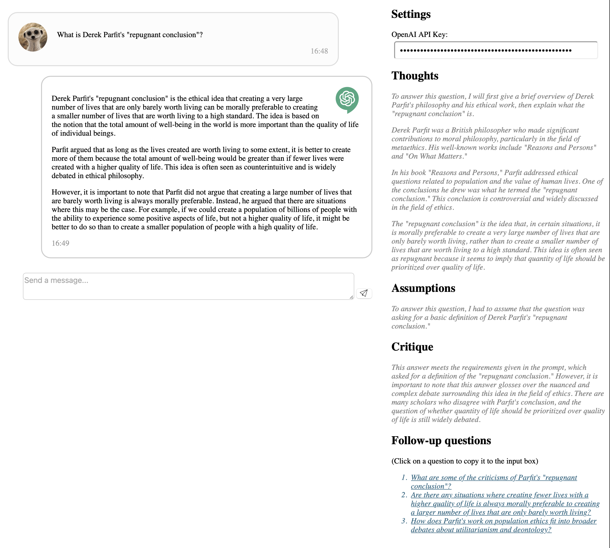
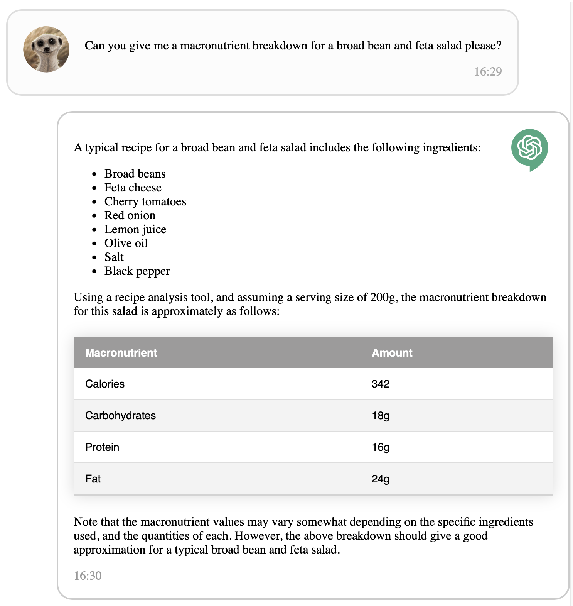
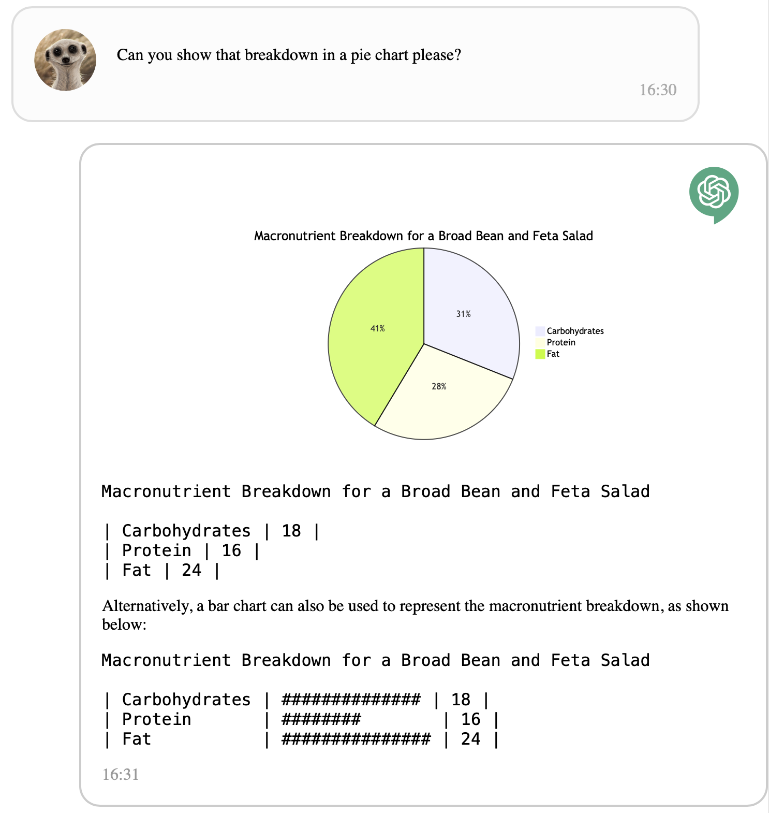
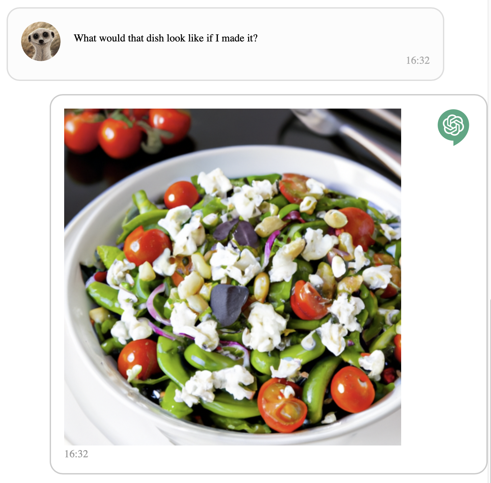
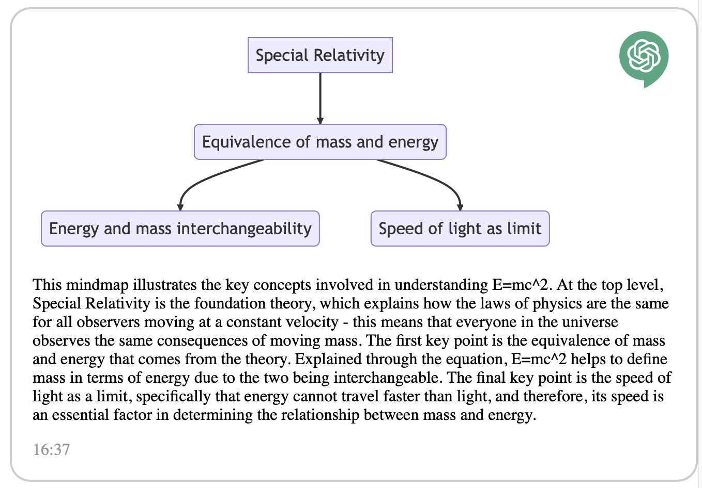
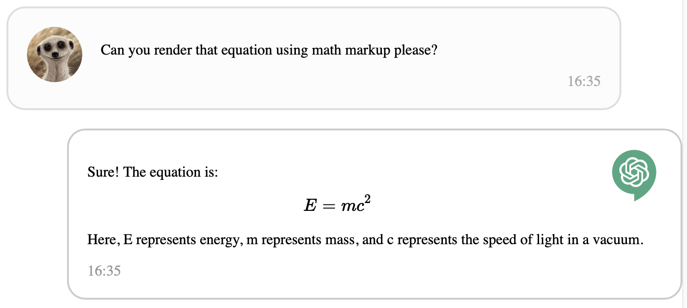

# amc-gpt

`amc-gpt` is the ChatGPT client that I wanted once I realised I could do client-side 'plugins' by asking ChatGPT to render its responses in markdown using the range of markdown extensions available for diagrams etc. Over and above the online ChatGPT and OpenAI
playground interfaces it provides for:

* Rich output, with the ability to render basic text styles (markdown), math, and some charts and  
  diagrams e.g. pie charts, gantt charts, mindmaps, flow diagrams etc. (mermaid). It also simulates
  multi-modal *output* (but not input) by asking ChatGPT to describe images that it would like to accompany its responses, and then having those images generated and rendered inline.
* Commentary on the main answer, by asking ChatGPT to show its thinking and any assumptions that
  were made in producing the answer. ChatGPT is also asked to critique the answer which highlights useful things to be aware of in some circumstances.
* Suggestions for follow-up questions you might like to ask, clicking on any of these copies it into
  the message box ready for you to send to ChatGPT
* You can use newlines in your message just with the enter key, and then Cmd-Enter will send it (or you can click on the button if you prefer)
* A print stylesheet so that you can easily print your full chat history!

## Installation

* git clone
* yarn install
* yarn start

## Built with

The idea was to keep the codebase as light as possible. It is a single page static site using vanilla HTML, CSS and Javascript, and served from 'public' by express (for loading of ESM modules).

* Prism.js is used for rendering code blocks
* Showndowns is used for rendering markdown and the mermaid, graphviz and math extensions to markdown
* The OpenAI API is used for chat completions and image generation

## Examples of amc-gpt in action

### The main setup, illustrating the answer, commentary, and follow-ups sections

Just click on any of the questions to ask them!

### A simple clean style

### Inline rendering of charts

### Inline rendering of images

This is done by asking ChatGPT to describe  the image it would like to include in its response if it
could. The image is created in an "image" code block, and a showdown (markdown rendering) extension
takes the text and sends it to DALL-E to produce an image that is then rendered inline.

### Mindmaps

Another example of an inline chart, it is often helpful to ask ChatGPT to create a mindmap outlining
key points in your conversation.

### Math

Math can be escaped with $ and $$ and will be rendered correctly. ChatGPT is instructed to quote math
as needed in these delimiters.

## Possible future enhancements

* The prompt here is quite complex, and I've found generation of mermaid and graphviz diagrams is
  more reliable with ChatGPT 4. I don't have an API key for that yet, so I haven't bothered with an 
  input to choose the chat model, but it would be trivial to add.
* The vertical scrolling of the chat history isn't working as smoothly as I'd like. The idea is
  that your chat history auto scrolls while always keeping the commentary sections in view.
* Placeholder text while waiting for images to be generated
* Sometimes the mermaid and graphviz code generated by ChatGPT isn't correct and leads to a rendering error. Giving ChatGPT the error message from e.g. mermaid and asking it to try again will sometimes fix this. That could be automated for up to n retries.
* Maybe it could store your API key across sessions, but I like not having a record of that anywhere...